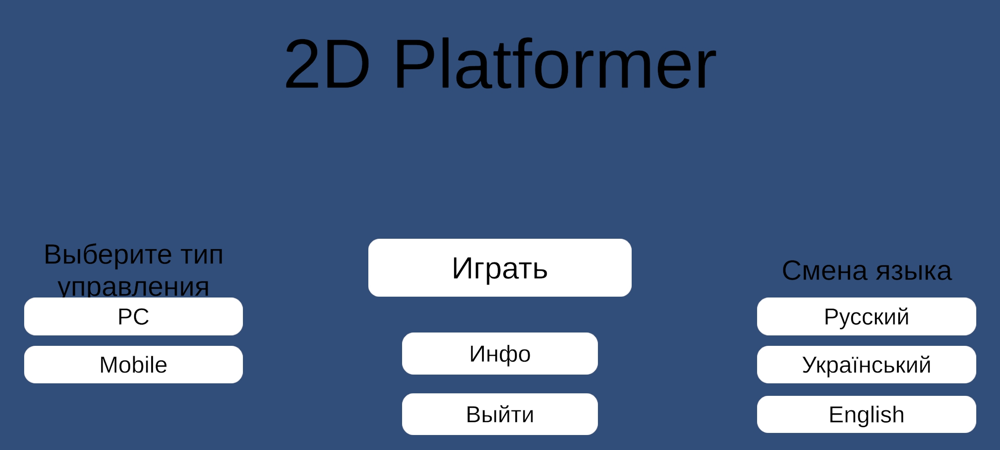
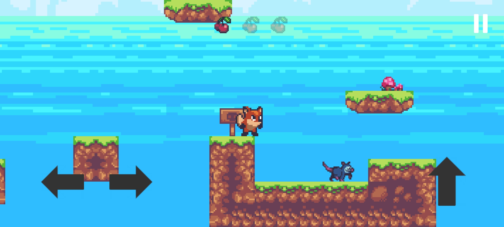
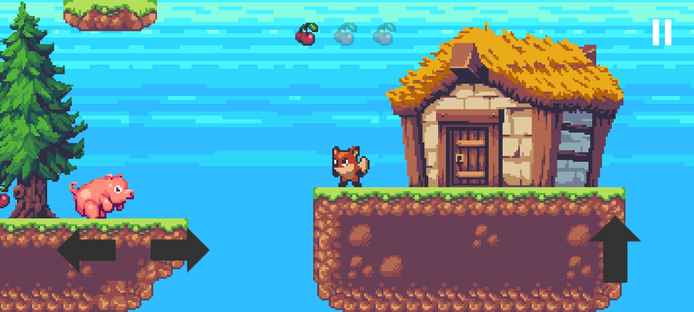

# 2D-Platformer

## Описание
- 2Д платформер где нужно собрать 3 вишенки и придти к домику. На пути будут встречаться разные враги, а именно: опоссум, свинья и летучая мышь. 
- Учебный проект (можно использовать в своих целях)
- Под PC/Mobile сборку
- Локализация на 3 языка: ру, укр, англ
- InputSystem сделан под PC и Mobile

## Стек
- Unity v2022.3.32f1

## Плагины и ассеты
- [LeanLocalization](https://assetstore.unity.com/packages/tools/localization/lean-localization-28504)
- [Sunny Land](https://assetstore.unity.com/packages/2d/characters/sunny-land-103349)
- [Simple UI Elements](https://assetstore.unity.com/packages/2d/gui/icons/simple-ui-elements-53276)